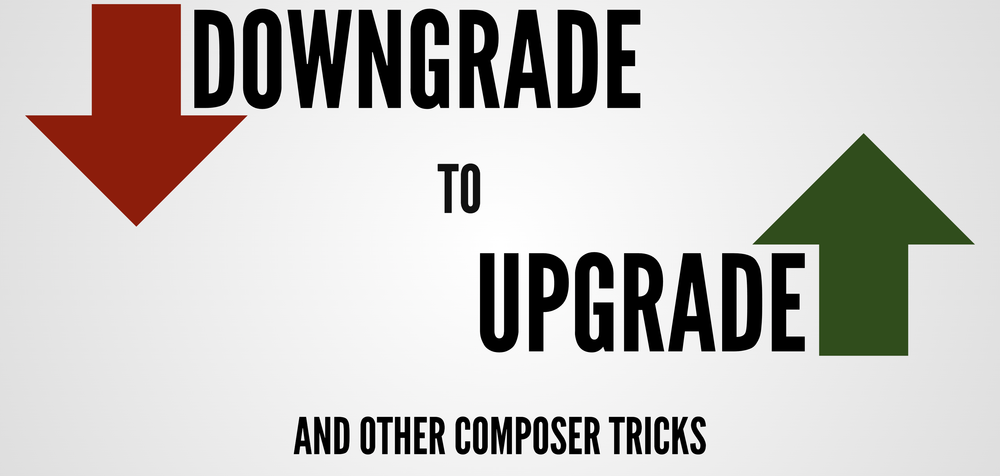

# Downgrade to Upgrade and Other Composer Tricks

## Latest Slides

**Slide Deck Link:** [https://wkdb.yt/downgrade-slides](https://wkdb.yt/downgrade-slides)

**Joind.in Link for Longhorn PHP 2023:** [https://joind.in/talk/970b2](https://joind.in/talk/970b2)

## Abstract
Thanks to the ubiquity of Composer, a PHP application may depend on dozens of third-party packages, each of which will define their own dependencies. When an application is deployed and working as expected, it can be difficult to prioritize the development time for package updates with breaking changes, and you might find some dependencies have slipped a few major versions behind their current release. Nevertheless, even if all root dependencies are up to date, some packages inevitably become abandoned, drop version constraints, or add an incompatible dependency. The end result: upgrading to the latest PHP version (or other package) is blocked by a tangled web of interdependent version conflicts and incompatible vendor code.

Luckily for us, Composer is more than just `install`, `require`, and `update`, and we can use some of the lesser known functionality and behavior to untangle the web of conflicts and create forward-friendly migration path. We'll cover:

- Using the `depends`, and `prohibits` commands to understand package relationships
- Using forked repositories and branch aliases to provide a compatible version of a package
- Preventing unnecessary transitive dependencies from being installed and causing conflicts
- Upgrading to the latest version of a package, by using Rector to downgrading it to your PHP version

## The "Must Know" Composer Commands for Conflict Resolution

#### Display All Installed Packages as a List
`composer show`

#### Display All Installed Packages as a Tree
`composer show --tree`

#### Display Details for Root Package
`composer show --self <version>`

#### Display Details for Installed Package
`composer show <package>`

#### Display Details for Installable Package
`composer show --available <package> <version>`

#### List Packages with Newer Releases Than Installed Version
`composer outdated`

#### Explain Why Composer Installed This Package
`composer depends <package>`

#### Explains Why Composer Cannot Install This Package
`composer prohibits <package> <version>`

## Downgrade Package Code with Rector

1. Install Rector: `composer install --dev rector/rector`
2. Update problem packages to latest version, explicitly requiring affected
    transitive dependencies directly with `composer require <package> --ignore-platform-reqs`
3. Move package files under version control, e.g. `mv vendor/laminas lib`
4. Add a new path repository entry for each dependency
5. Run Rector on files with downgrade rule: `php vendor/bin/rector process lib --config=rector-downgrade.php`
6. Run `composer update`
7. Double check that everything worked, run your test suite, code linter, and/or static analyzer.

## Resources

- [Official Composer Documentation](https://getcomposer.org/doc/)
- [The long journey of making PHP’s Composer memory-efficient and fast](https://medium.com/@yanick.witschi/the-long-journey-of-making-phps-composer-memory-efficient-and-fast-63d12944aaa8
  ) Blog Post By Yanick Witschi
- [Rector](https://getrector.com/) - Installation & Configuration Documentation
- [Rector Github](https://github.com/rectorphp/rector) - Links to Rules
